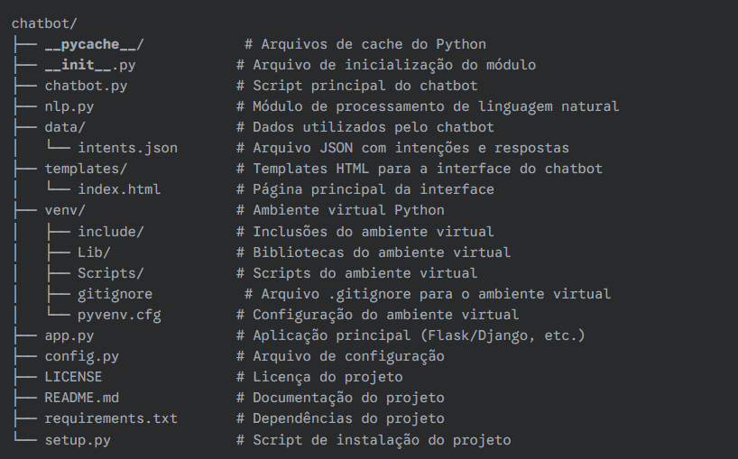

# 🤖 Chatbot em Python com NLP

Este é um projeto de chatbot desenvolvido em Python, utilizando Processamento de Linguagem Natural (NLP) para interpretar e responder a perguntas em linguagem natural. Ele inclui uma interface web usando Flask.

## 📌 Funcionalidades

- Responde a perguntas comuns com base em intenções definidas.
- Utiliza **NLTK** para pré-processamento do texto.
- Interface web interativa construída com **Flask**.
- Estrutura modular para facilitar a manutenção e expansão.

## 🏗 Estrutura do Projeto



---

## 🚀 Como Executar o Projeto

### 1️⃣ Clonar o Repositório

```bash
git clone https://github.com/SEU_USUARIO/chatbot-python.git
cd chatbot-python
```

### 2️⃣ Criar e Ativar o Ambiente Virtual

python -m venv venv
# Ativar no Windows:
venv\Scripts\activate
# Ativar no Linux/macOS:
source venv/bin/activate

### 3️⃣ Instalar Dependências

pip install -r requirements.txt

### 4️⃣ Executar o Servidor Flask

python app.py

O chatbot estará disponível em http://127.0.0.1:5000/