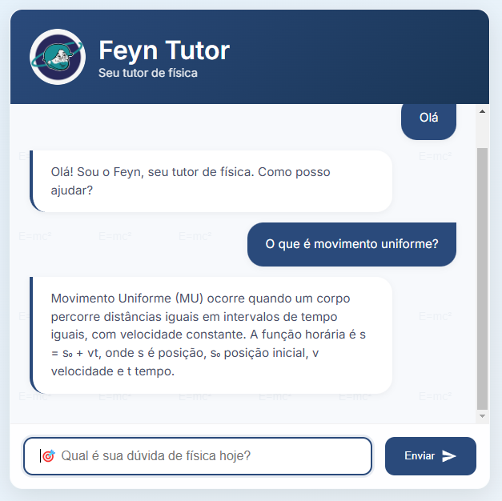
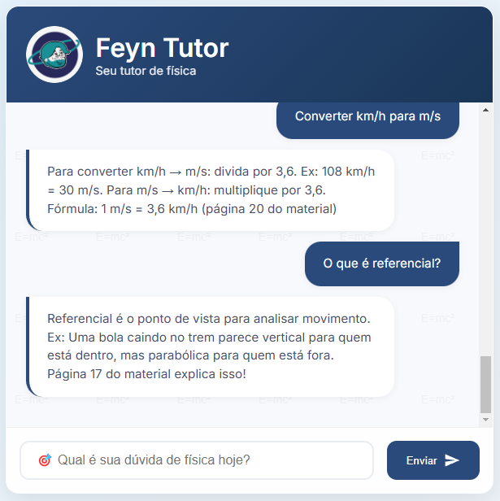

# 🤖 Chatbot Python com NLP

Este é um projeto de chatbot desenvolvido em Python que atua como tutor de física para alunos do ensino médio. Utilizando Processamento de Linguagem Natural (NLP) com **NLTK**, o chatbot interpreta perguntas em linguagem natural e responde com base em intenções pré-definidas. A interface web interativa é construída com **Flask**.

## 📌 Funcionalidades

- Responde a dúvidas comuns de física com base em intenções definidas.
- Utiliza **NLTK** para pré-processamento do texto (tokenização, remoção de pontuações e stopwords).
- Interface web interativa que simula um ambiente de chat.
- Estrutura modular, facilitando a manutenção e futuras expansões.

## 🎥 Demonstração do Projeto





## 🏗 Estrutura do Projeto


```plaintext
chatbot-python/
├── chatbot/
│   ├── __init__.py
│   ├── chatbot.py
│   ├── nlp.py
│   ├── data/
│   │   └── intents.json
│   ├── static/
│   │   └── logo.png
│   └── templates/
│       └── index.html
├── venv/
├── app.py
├── stup.py
├── config.py
├── setup.py
├── requirements.txt
├── .gitignore
├── README.md
├── estrutura.png
└── LICENSE
```

## 🚀 Como Executar o Projeto

### Clonar o Repositório

```bash
git clone https://github.com/SEU_USUARIO/chatbot-python.git
cd chatbot-python
```
### Criar e Ativar o Ambiente Virtual

```bash
python -m venv venv

venv\Scripts\activate
```

### Instalar Depêndecias

```bash
pip install -r requirements.txt
```

### Baixar os Pacotes do NLTK

```bash
python setup.py
```

### Executar o Servidor Flask

```bash
python app.py
```

O chatbot estará disponível em http://127.0.0.1:5000/.

## 📄 Exemplo de Uso

1. Acesse a interface web e envie uma mensagem para o chatbot.
2. Exemplos de mensagens:
    "Oi" → O bot responde: "Olá! Sou o Feyn, seu tutor de física. Como posso ajudar?"
    "Obrigado" → O bot responde: "De nada! Qualquer dúvida é só perguntar."
    "O que é movimento uniforme?" → O bot explica o conceito de movimento uniforme.

## 🎯 Melhorias Futuras

* Integração com modelos de aprendizado de máquina para respostas mais avançadas.
* Utilização de modelos pré-treinados (como BERT) para aprimorar a compreensão do texto.
* Expansão da base de conhecimento para incluir mais tópicos de física.
* Melhoria da interface web com frameworks modernos (Bootstrap, React).
* Implementação de um sistema de feedback para aprimoramento contínuo.

## 📌 Contribuição
Sinta-se à vontade para contribuir! Para isso:

1. Faça um Fork deste repositório.
2. Crie uma branch: git checkout -b minha-nova-feature
3. Faça suas alterações e commit: git commit -m "Adicionando nova feature"
4. Envie para o repositório: git push origin minha-nova-feature
5. Abra um Pull Request!

## 🔗 Contato
📧 Email: lagecomg@gmail.com
🔗 [LinkedIn](www.linkedin.com/in/pedro-lage-9579742a1)